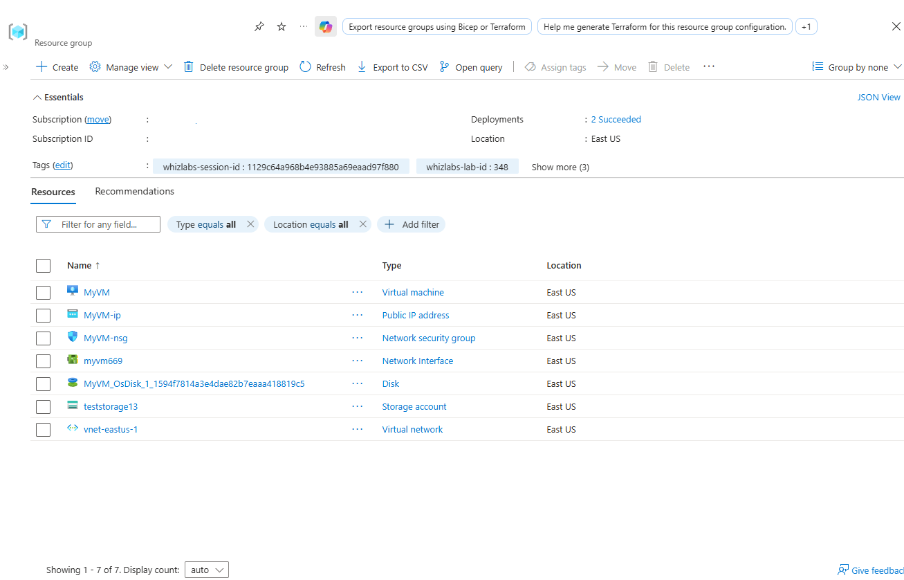
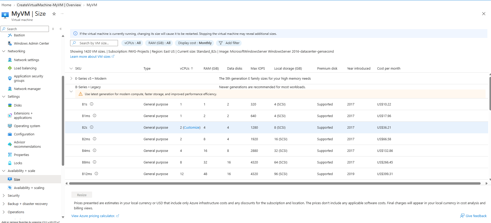
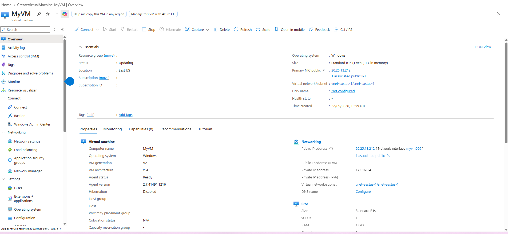
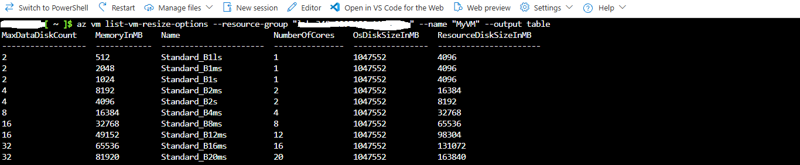
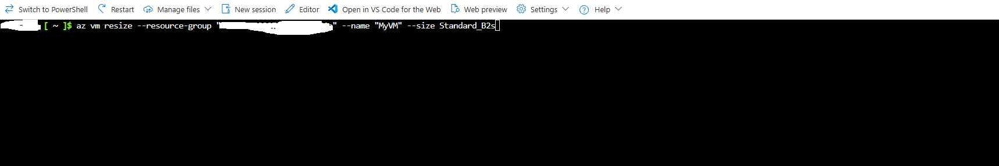
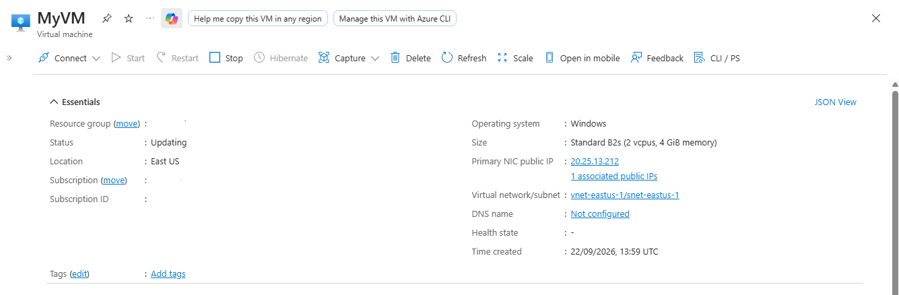

# Resizing Azure Virtual Machines

## Project Summary
* **Lab Name:** Resizing of Virtual Machine
* **Platform:** Microsoft Azure
* **Status:** Completed successfully
* **Validation Methods:** Azure Portal & Azure CLI (Cloud Shell)

---

## 1. Deployed Infrastructure Verification
Prior to executing the resizing procedures, all required supporting resources were verified in the `East US` region.

* **Virtual Machine:** `MyVM` (Windows Server 2016 Datacenter)
* **Virtual Network:** `vnet-eastus-1` (`172.16.0.0/16`)
* **Subnet:** `snet-eastus-1` (`172.16.0.0/24`)
* **Network Interface:** `myvm669` (Private IP: `172.16.0.4`)
* **Public IP:** `MyVM-ip` (`20.25.13.212`)
* **Network Security Group:** `MyVM-nsg` (RDP Port 3389 inbound open)
* **Storage Account:** `teststorage13`

---

## 2. Initial Configuration Review
Inspected the VM size configurations under **MyVM > Settings > Size** to verify the baseline hardware allocation and review available SKUs within the current cluster.

* **Initial VM SKU:** `Standard_B2s` (2 vCPUs, 4 GiB memory)

---

## 3. Scale-Down Execution (Azure Portal)
Executed vertical downscaling via the Azure Portal:

1. Selected the `Standard_B1s` SKU from the sizing blade.
2. Initiated the resize operation.
3. Verified that the VM updated successfully to `Standard B1s` (1 vCPU, 1 GiB memory) in the **Overview** blade.

---

## 4. Hardware Availability Check (Azure CLI)
Opened Azure Cloud Shell to query valid resize candidates available on the active compute cluster:

Confirmed that Standard_B2s was listed and available for redeployment.

## 5. Final State Validation
Navigated back to the Azure Portal Overview blade to validate successful execution:

Current Size: Standard B2s (2 vcpus, 4 GiB memory)

Status: Updating / Completed

Public IP: 20.25.13.212
